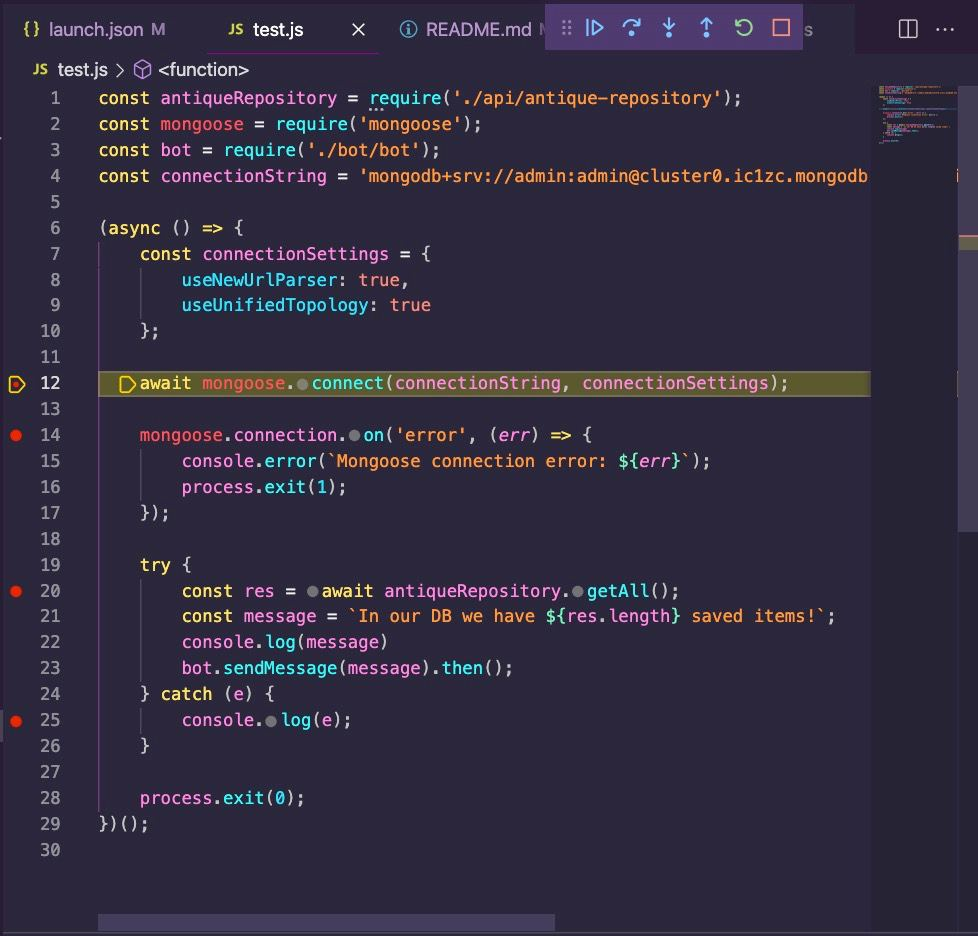

# TBD
Antique-Bot is made for searching and posting new antiques from various websites to various channels (telegram, email, etc.)

## Where to start
**index.js** is a classic entry point for the whole bot
package.json is an essential file for npm modules which are used in the project

## Join Bot today!
https://t.me/+bGj-7JAEZy5kYTIy

## Installation
1. make sure you have node.js 16.* version installed
```
node -v
// v16.17.1
```
2. Install npm packages (libs which are used for development)
```
npm install
// all packages should be installes in ./node-modules folder
```

3. Run test file to make sure everything is working
- Open Run and Debug panel in VSCode
- Put some breakpoints on test.js file
- Choose "Run Debug TEST.JS" configuration to run
- Observe and be happy! You should have something like on image below!
- If nothing goes well, fix it


